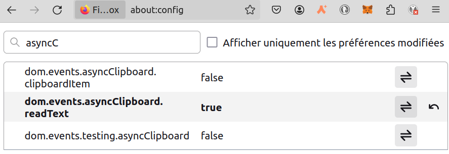

# Abi for the tutorial
Click hereunder on the copy icon, on the top right of the abi code.  
Then paste it in the DAPP : Click in the DAPP on `Pasted Abi`, then on `Paste Abi`. If necessary, confirm to the browser that you accept to paste the data.

> [!WARNING]
> In FireFox, by default, it's not allowed to paste data. You have to configure it this way :
> 1. Enter about:config in navigation bar
> 2. Click "Accept the Risk and Continue"
> 3. Search dom.events.asyncClipboard.readText and set true.
>    


```json
[
    {
      "type": "struct",
      "name": "core::byte_array::ByteArray",
      "members": [
        {
          "name": "data",
          "type": "core::array::Array::<core::bytes_31::bytes31>"
        },
        {
          "name": "pending_word",
          "type": "core::felt252"
        },
        {
          "name": "pending_word_len",
          "type": "core::integer::u32"
        }
      ]
    },
    {
            "type": "struct",
            "name": "core::starknet::account::Call",
            "members": [
                {
                    "name": "to",
                    "type": "core::starknet::contract_address::ContractAddress"
                },
                {
                    "name": "selector",
                    "type": "core::felt252"
                },
                {
                    "name": "calldata",
                    "type": "core::array::Array::<core::felt252>"
                }
            ]
        },
    {
      "type": "struct",
      "name": "PhilTest2::PhilTest2::Order",
      "members": [
        {
          "name": "p1",
          "type": "core::felt252"
        },
        {
          "name": "p2",
          "type": "core::integer::u16"
        }
      ]
    },
    {
      "type": "enum",
      "name": "PhilTest2::PhilTest2::MyEnum",
      "variants": [
        {
          "name": "Response",
          "type": "PhilTest2::PhilTest2::Order"
        },
        {
          "name": "Warning",
          "type": "core::felt252"
        },
        {
          "name": "Error",
          "type": "(core::integer::u16, core::integer::u16)"
        },
        {
          "name": "Critical",
          "type": "core::array::Array::<core::integer::u32>"
        },
        {
          "name": "Message",
          "type": "core::bytes_31::bytes31"
        },
        {
          "name": "Empty",
          "type": "()"
        }
      ]
    },
    {
      "type": "enum",
      "name": "core::option::Option::<core::integer::u8>",
      "variants": [
        {
          "name": "Some",
          "type": "core::integer::u8"
        },
        {
          "name": "None",
          "type": "()"
        }
      ]
    },
    {
      "type": "enum",
      "name": "core::option::Option::<PhilTest2::PhilTest2::Order>",
      "variants": [
        {
          "name": "Some",
          "type": "PhilTest2::PhilTest2::Order"
        },
        {
          "name": "None",
          "type": "()"
        }
      ]
    },
    {
      "type": "struct",
      "name": "PhilTest2::PhilTest2::OrderW",
      "members": [
        {
          "name": "p1",
          "type": "core::felt252"
        },
        {
          "name": "my_enum",
          "type": "PhilTest2::PhilTest2::MyEnum"
        },
        {
          "name": "adds",
          "type": "core::option::Option::<core::integer::u8>"
        }
      ]
    },
    {
      "type": "enum",
      "name": "core::result::Result::<core::integer::u8, core::felt252>",
      "variants": [
        {
          "name": "Ok",
          "type": "core::integer::u8"
        },
        {
          "name": "Err",
          "type": "core::felt252"
        }
      ]
    },
    {
      "type": "enum",
      "name": "core::result::Result::<PhilTest2::PhilTest2::Order, core::integer::u16>",
      "variants": [
        {
          "name": "Ok",
          "type": "PhilTest2::PhilTest2::Order"
        },
        {
          "name": "Err",
          "type": "core::integer::u16"
        }
      ]
    },
    {
      "type": "struct",
      "name": "core::integer::u256",
      "members": [
        {
          "name": "low",
          "type": "core::integer::u128"
        },
        {
          "name": "high",
          "type": "core::integer::u128"
        }
      ]
    },
    {
      "type": "interface",
      "name": "PhilTest2::PhilTest2::ITestContract",
      "items": []
    }
]
```