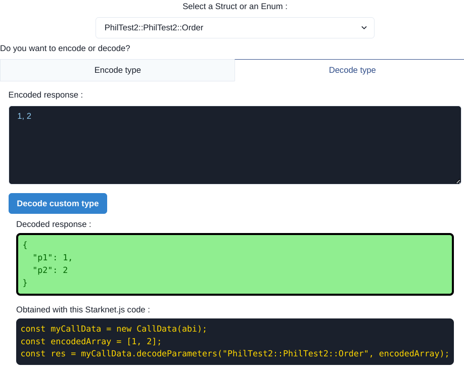
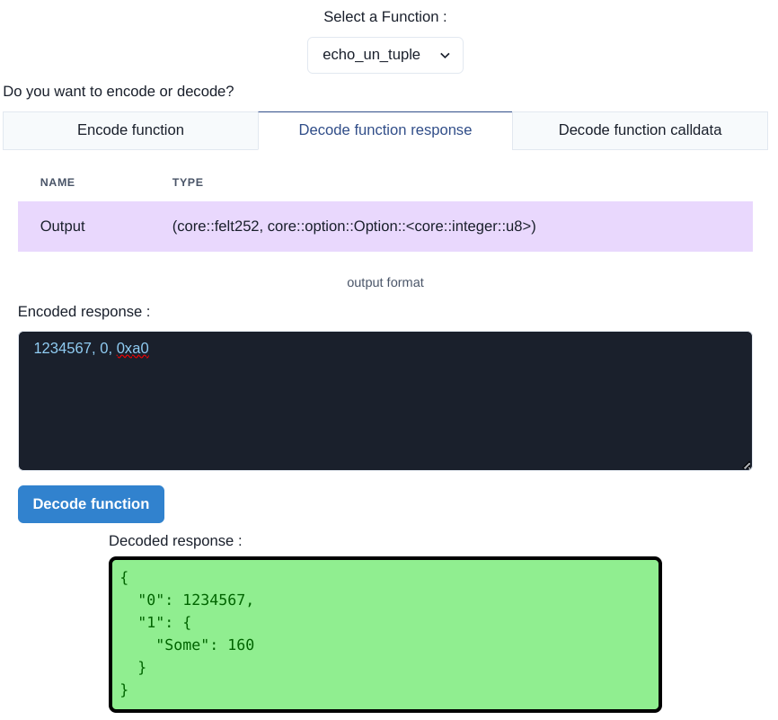
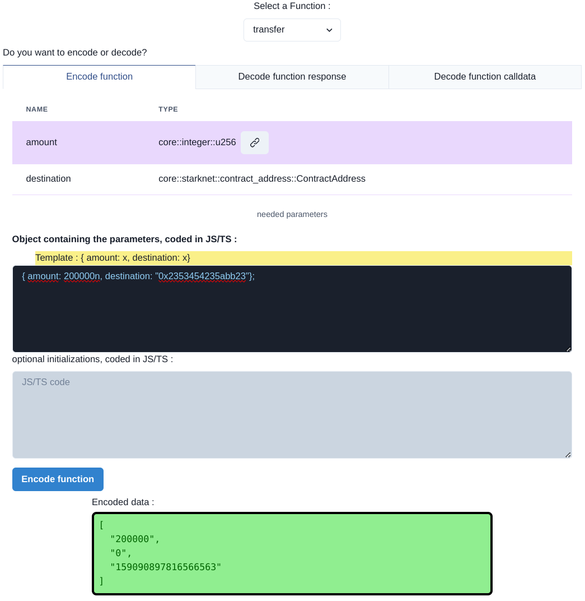

# Tuto for Starknet-encode-decode
<p align="center">
  
</p>
Starknet-encode-decode is a useful tool to encode/decode messages to/from Starknet.  
But it's also a pedagogical tool, to understand how Starknet is communicating : it shows how to use Starknet.js to encode/decode Starknet messages.

> [!NOTE]
> The duration to complete this tuto is about 30 minutes.

- [Tuto for Starknet-encode-decode](#tuto-for-starknet-encode-decode)
  - [Initialization :](#initialization-)
  - [Types :](#types-)
    - [literal :](#literal-)
    - [Structs :](#structs-)
      - [struct :](#struct-)
      - [u256 :](#u256-)
      - [u512 :](#u512-)
    - [Enums :](#enums-)
      - [Option :](#option-)
      - [Result :](#result-)
      - [Custom enum :](#custom-enum-)
    - [Tuple :](#tuple-)
    - [Array and Span :](#array-and-span-)
    - [Bytes31 :](#bytes31-)
    - [ByteArray :](#bytearray-)
    - [Complex mix :](#complex-mix-)
  - [Functions :](#functions-)
    - [Decode function response :](#decode-function-response-)
    - [Encode function request :](#encode-function-request-)


## Initialization :
First, we have to initialize the definition of the contract we will use.  
Each contract includes a part called ABI ; it's a JSON that defines all types and functions that can be used in the contract.
Follow the instructions [here](./abiForTuto.md).

From now, I recommend to use the DAPP in a browser, and to follow the tuto in a separated browser, to have both windows visible at the same time.

## Types :
Let's start with easy cases.

### literal :
Literals are basic types, like `u8` (unsigned integer on 8 bits) or `felt252` (unsigned integer on 252 bits).  
They are not visible in the `Custom type` tab, but we will use them soon.

### Structs :
A Cairo struct is the equivalence of a JS object. It's used for both standard types and custom objects.

#### struct :
Example of a custom struct :
```json
{
    "type": "struct",
    "name": "PhilTest2::PhilTest2::Order",
    "members": [
      {
        "name": "p1",
        "type": "core::felt252"
      },
      {
        "name": "p2",
        "type": "core::integer::u16"
      }
    ]
  }
```
Click the `Custom type` tab, then select  `PhiTest2::PhiTest2::Order`.
We will first look at the decoding :  
Click `Decode type` tab.  
When Starknet is sending an encoded `Order` type, you receive 2 numbers ; for example `1, 2`.  
Enter these 2 numbers in the `encoded response` field, then click on `Decode custom type`. The decoding job has generated an object, with the corresponding keys and values :

> [!NOTE]
> Below the decoded response, you have the Starknet.js code to perform the same job.  
> It's useful to help to code your scripts.


Let's see now the encoding :  
Click `Encode type` tab. 
For the moment, we will not write anything in the `optional initializations` ; we will see this field later.  
We have here to enter the definition of a JS object, describing the Cairo Struct. Enter :
```typescript
{p1: 8, p2: 9}
```
Then click on `Encode custom type`. 
The response of any encoding is always an array of numbers, that Starknet is able to understand.  
Here, the response is : 
```json
["8","9"]
```
Easy! Isn't it?
We will progressively increase the level of difficulty...

#### u256 :
Select the `core::integer::u256` type. It's a "large" number coded with 2 "small" numbers.  
For decoding, click `Decode type` tab. You can enter for example `1,2`. Then click on `Decode custom type`. The decoded u256 is displayed : `680564733841876926926749214863536422913`

For encoding, click `Encode type` tab. We will see now 3 ways to encode a uint256.  
1. Using an object : as shown on the screen, an uint256 is a struct with 2 items. So, you can enter `{low: 1, high: 2}`

The result is 
```json
["1","2"]
```
2. Using Starknet.js functions. You can enter `cairo.uint256(680564733841876926926749214863536422913n)`
3. Using Starknet.js auto-recognition of u256 : `680564733841876926926749214863536422913n`

#### u512 :
Select the `core::integer::u512` type. Very similar to uint256, it's a "very large" number coded with 4 "small" numbers.  

For decoding, click `Decode type` tab. You can enter for example `16926926749214863536422913, 20000000000000000000000000, 0, 0`. Then click on `Decode custom type`. The decoded u512 is displayed : `6805647338418769269267492148635364229136926926749214863536422913n`

For encoding, click `Encode type` tab.
You can use 3 similar to u256 ways to proceed : `limb0:16926926749214863536422913, limb1:20000000000000000000000000, limb2: 0, limb3:0}` or `cairo.uint512(6805647338418769269267492148635364229136926926749214863536422913n)` or `6805647338418769269267492148635364229136926926749214863536422913n`

### Enums :
We have seen the Structs ; let's now see something more complicated : the Enums. There is 3 types of Enums.
#### Option :
An option is an item that can have 2 states : Some & None.  
- Some contains any type of literal or custom type.
- None is always empty.
Let's first see how to encode :  
Select  `core::option::Option::<core::integer::u8>` type, and click `Encode type` tab.
- Try to encode an option with the variant `Some`, including a u8 literal : `new CairoOption<BigNumberish>(CairoOptionVariant.Some,18);`. Encoding result is `0, 18`.
- Try to encode an option with the variant `None` : `new CairoOption<BigNumberish>(CairoOptionVariant.None,{});`. Encoding result is `1`.

For decoding, click `Decode type` tab.
- You can enter for example `0, 47`. Then click on `Decode custom type`. The decoded Option is a `CairoOption` instance, with `Some` variant selected, containing the number 47.
- You can also enter  `1`. Then click on `Decode custom type`. The decoded Option is a `CairoOption` instance, with `None` variant selected.

#### Result :
`Result` is very similar to the `Option` Enum. It has 2 variants : `Ok` and `Err`, both contains any type of literal or custom type.  
Let's first see how to encode :  
Select  `core::result::Result::<core::integer::u8, core::felt252>` type, and click `Encode type` tab.
- Try to encode a result with the variant `Ok`, including a u8 literal : `new CairoResult<BigNumberish, BigNumberish>(CairoResultVariant.Ok,123);`. Encoding result is `0, 123`.
- Try to encode a result with the variant `Err` : `new CairoResult<BigNumberish, BigNumberish>(CairoResultVariant.err,400);`. Encoding result is `1, 400`.

For decoding, click `Decode type` tab.
- You can enter for example `0, 47`. Then click on `Decode custom type`. The decoded Result is a `CairoOption` instance, with `Some` variant selected, containing the number 47.
- You can also enter  `1`. Then click on `Decode custom type`. The decoded Option is a `CairoOption` instance, with `None` variant selected.

#### Custom enum :
And finally, the third type of Enum : the custom Enum. You have to define each variant and each corresponding type.  
Let's first see how to encode :  
Select  `PhilTest2::PhilTest2::MyEnum` type, and click `Encode type` tab.  
Try to encode this Enum (that includes 4 custom variants) with the variant `Warning`, including a string (felt252) : `new CairoCustomEnum({ Warning: "Wrong address" });`. Encoding result is `1, 6928266141989268944028931814259`.

`1` is the id number of this variant, and the long number is the encoding of the string "Wrong address" (31 characters maxi).

For decoding, click `Decode type` tab.
You can enter for example `0, 10, 20`. Then click on `Decode custom type`. The decoded Enum is a `CairoCustomEnum` instance, with `Response` variant selected, containing the `Order` struct : `{"p1": 10, "p2": 20}`.

### Tuple :
A tuple is a group of values of random types, enclosed in parenthesis.  
We will test a tuple, with the same case used for the Custom enum test.

For encoding, Select  `PhilTest2::PhilTest2::MyEnum` type, and click `Encode type` tab.
Try to encode this Enum with the variant `Error`, including a tuple of two literal : `new CairoCustomEnum({ Error: cairo.tuple(400,13) });`. Encoding result is `2, 400, 13`. 

For decoding, click `Decode type` tab.
You can enter for example `2, 100, 200`. Then click on `Decode custom type`. The decoded Enum is a `CairoCustomEnum` instance, with `Error` variant selected, containing a tuple : `{"0": 100, "1": 200}`.  
As you can see, Starknet.js represents a tuple with an object, where keys are string numbers.

### Array and Span :
Arrays & Spans are similar to JS arrays.  
We will test an array, still with the case used for the Custom enum test.

For encoding, Select  `PhilTest2::PhilTest2::MyEnum` type, and click `Encode type` tab.
Try to encode this Enum with the variant `Critical`, including an array of 4 u32 literals : `new CairoCustomEnum({ Critical: [30, 40, 50, 60]});`. Encoding result is `3, 4, 30, 40, 50, 60`.  
3 is the variant id, 4 is the number of items in th array, then follow the content of the array.

For decoding, click `Decode type` tab.
You can enter for example `3, 2, 10, 20`. Then click on `Decode custom type`. The decoded Enum is a `CairoCustomEnum` instance, with `Critical` variant selected, containing an array of 2 numbers : `[10, 20]`.  

### Bytes31 :
bytes31 is useful for strings with 31 characters max.  
We will test a bytes31, once again with the case used for the Custom enum test.

For encoding, Select  `PhilTest2::PhilTest2::MyEnum` type, and click `Encode type` tab.
Try to encode this bytes31 with the variant `Message`, including a string : `new CairoCustomEnum({ Message: "Your credit has expired."});`. Encoding result is `4, "0x596f7572206372656469742068617320657870697265642e"`.  
4 is the variant id, followed by the encoded string.

For decoding, click `Decode type` tab.
You can enter for example `4, 7165025766919037752308702341934`. Then click on `Decode custom type`. The decoded Enum is a `CairoCustomEnum` instance, with `Message` variant selected, containing a string.  

### ByteArray :
ByteArray is useful for strings of any length (in particular for strings larger than 31 characters). The encoding/decoding of a ByteArray is really not trivial, and Starknet.js provides here a way to do this very easily.
For encoding, Select  `core::byte_array::ByteArray` type, and click `Encode type` tab.
Try to encode this string : `"O Fortuna velut Luna statu variabilis,  semper crescis aut decrescis.";`. Encoding result is :
```json
[
  "2",
  "0x4f20466f7274756e612076656c7574204c756e612073746174752076617269",
  "0x6162696c69732c202073656d70657220637265736369732061757420646563",
  "0x7265736369732e",
  "7"
]
```
Not really trivial!  

For decoding, click `Decode type` tab.
You can enter for example `2, 122225678809166802053404682793675375970313312833871170891445048468036349285, 57342704614114685661171482295296418849492654506743665597013200343304249456, 174161157661115001344984168060139367143550633101782920564466990, 26`. Then click on `Decode custom type`. The decoded ByteArray is a string.  

### Complex mix :
We have not yet used the `optional initialization` area in the `Encode type` tab. Let's see this in detail.  
For complex or mixed cases, it's necessary -at least for the readability of your code- to initialize some data in advance.  
Select  `PhilTest2::PhilTest2::OrderW` type, and click `Encode type` tab.  
We have here a type nested in 3 levels. You can test this code in the Initialization area :
```typescript
const myArray = [1,2,3];
const testEnum = new CairoCustomEnum({ Critical: myArray });
const myOption = new CairoOption<BigNumberish>(CairoOptionVariant.Some,100);
```
and this code in the content area :
```typescript
{p1: 2345n,
my_enum: testEnum,
adds: myOption}
```
You have a more readable code, and the result is :


## Functions :
We have explored the `Custom type` tab ; the most difficult part is made. Let's see now how to encode/decode data to interact with Starknet contract functions.  

### Decode function response :
To decode the response of a function, it's not complicated :
- All functions with a `state_mutability` set to `external`  do not provides any response to Starknet.js (even if the abi lists some outputs).
- Functions with a `state_mutability` set to `view` provides an encoded response. This response includes only one item. If several values are returned, they are enclosed in a tuple.
Select the `Function` tab. Select  `get_owner` type, and click `Decode function` tab.   
The function is sending just a ContractAddress. Enter `0x37bfdeb9c262566183211b89e85b871518eb0c32cbcb026dce9a486560a03e0` in the Encoded response to test the decoding.  
You have immediately the response.

Select the `Function` tab. Select  `echo_un_tuple` function, and click `Decode function` tab. 
You can see that this case is more complicated : the response is a tuple, that includes a felt252 and an Option.  
Try `1234567, 0, 0xa0`. The response is conform : a tuple with a number and an Option :


### Encode function request :
Let's finish with the encoding of the parameters that you want to send to your Starknet smartcontract function.  
Select  `echo_un_tuple` function, and click `Encode function` tab.  
You can see that this function is expecting 2 parameters. Let's build an object including these parameters. You can see that the DAPP is proposing a template to help you.  
Enter in the `Object` text area : `{ amount: 200000n, destination: "0x2353454235abb23"};` then click on `Encode function`.
You have just under the result :

We have a 0 after the number 200000, because an uint256 is coded on 2 numbers (as we have seen previously).
And you can see at the end how to obtain the same result using starknet.js :


And finally, a function with 3 complicated parameters. Select  `swap` function, and click `Encode function` tab.  
We will use the `optional initialization` area to have a clean code :  
Enter in this area :
```typescript
type PairSwapAny = {pair: BigNumberish, num_items: BigNumberish};
const pair1: PairSwapAny = {pair: "0x12e345", num_items: 56789n};
const pair2: PairSwapAny = {pair: "0x4a5678", num_items: 333567n};
```
and this code in the `Object` area :
```typescript
{swap_list: [pair1, pair2], input_amount: 40000n, deadline: 287534567};
```
The result is :


Congratulation. You are now an expert of encoding and decoding Starknet data.

